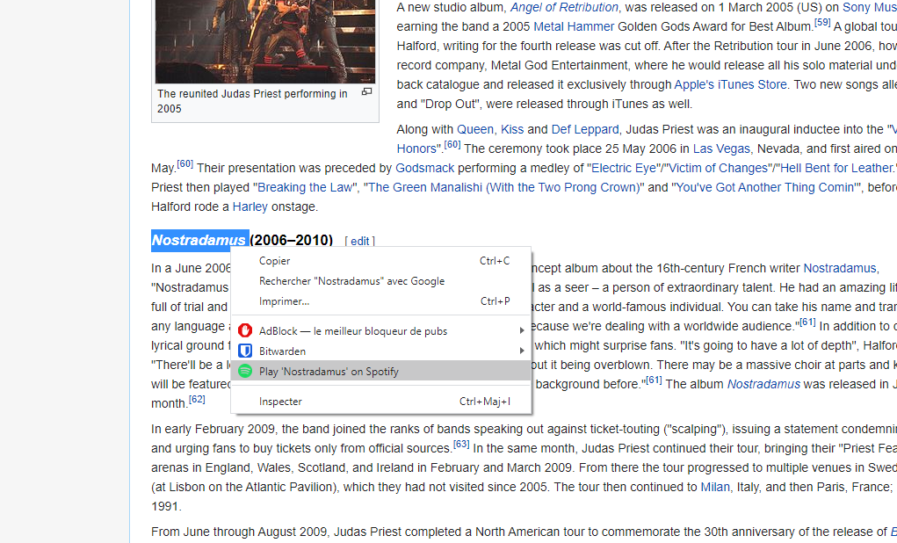

# SpotifySelectionLauncher-Chrome

Chrome Extension for quickly search Spotify from your text selection

It will simply launch a Spotify tab and search what you select in it. It's very useful to me as I spend hours crawling in the Heavy Metal parts of Wikipedia.

If the Spotify tab is already opened, it will simply update it with your search.

## Installation 

The app is not yet on the Google Store. To add it, clone the repository, and add the folder to Chrome extensions by enabling developer mode and go [here](chrome://extensions)